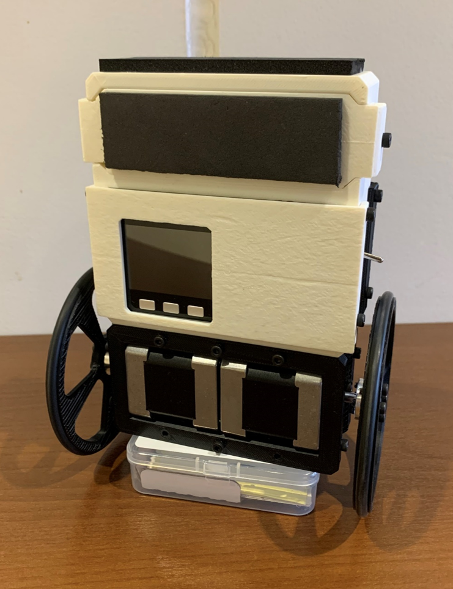
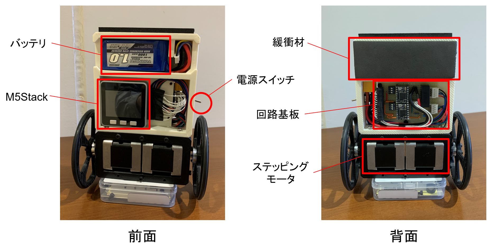
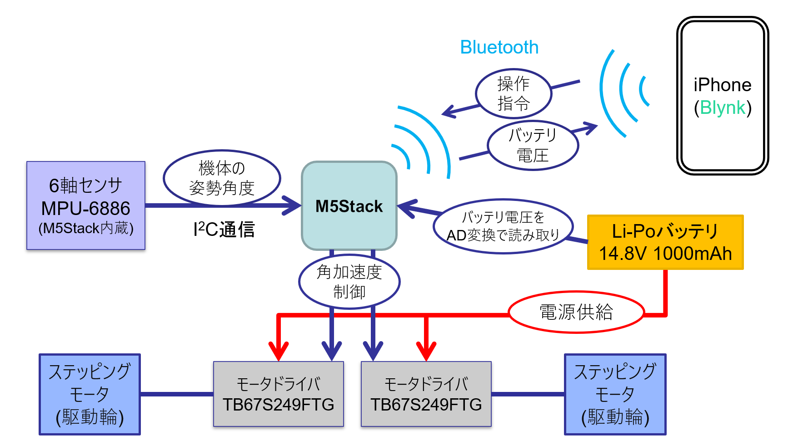
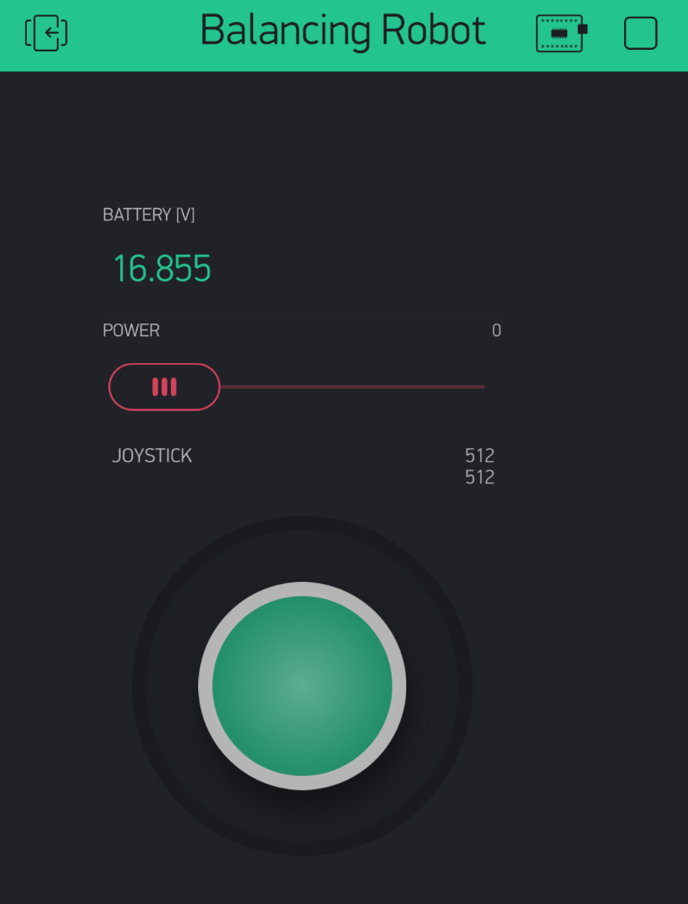
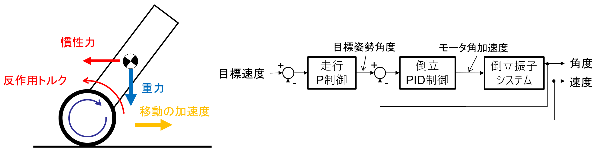

# M5_Self-Blancing_Car

 

## 概要
- M5Stack-Greyを使って車輪型の倒立振子ロボットを作った
- BlynkというiPhoneアプリを使ってラジコンみたいに操作できる
- 300gぐらいならおもりを載せても動作可
- 楽しい

---

## 走行動画
https://github.com/Yoshiaki-Abe/M5_Self-Blancing_Car/assets/77134300/6b4af9cf-51b0-4ec8-abd3-7b5466c82a7e

---

## 背景
- M5Stack Greyを手に入れたので，何か作ろう
- M5Stack Greyの特徴が活かせるものがいい？
    - WiFi/Bluetoothによる無線接続
    - 最低限のGPIOポート
    - マイコン用Li-Poバッテリ内蔵
    - IMU内蔵，傾きの検知ができる
- 倒立振子は制御工学でよく扱う題材，一度作ってみたいので，これを機にやってみる

---

## ハードウェア
- 3DプリンタでABS樹脂を使って外装を作成
- 車輪は3Dプリンタ製のホイールにOリングをはめて作成
- 転倒時の衝撃対策にウレタン緩衝材を搭載
- ステッピングモータ
    - 入手性が良く，制御しやすい
    - トルクがそれなりにあるので，ダイレクトドライブで使える．ギヤのバックラッシは倒立振子の挙動を不安定にさせやすい．

 

 

### 内部  
- バッテリ・回路基板を内蔵

 

---

## システム構成

 

 

### Blynkアプリの操作画面
- ジョイスティックによる走行操作
- 遠隔でのモータ電源のON/OFF  
- バッテリ電圧の監視

 

---

## 制御
- 倒立制御
  - 機体の倒れた方向へ車輪（モータ）を回転させ移動
  - モータの反作用トルクと移動加速度による慣性力によって起き上がる
  - モータ角加速度により，機体の角度をPID制御をする
- 倒立しながらの走行制御
  - 傾けた状態で倒立させる（倒立のPID制御の目標角度を傾ける）
  - 倒れるモーメント（重力）とモータ出力による起き上がるモーメントが釣り合うよう制御される
  - 倒れる角度に応じてモータの出力が定まり，移動する
  - 目標姿勢角度により，機体の移動速度をP制御する

 

